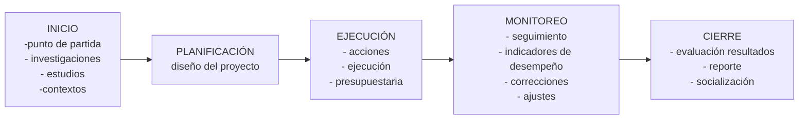

# sesion-01

2026-03-09, lunes

## introducción

formular proyectos, se relaciona con "inventarse un quehacer". ¿En qué ámbito quiero estar?

el diseñador en sí tiene cierta propuesta de valor. El ámbito del diseño está dentro del área de los servicios.

"TÚ ERES EL PROYECTO"

un pitch es comunicar la oferta de valor de manera precisa, es algo que se entrena.

Valoremos la singularidad. Diferenciarse. Cuidemos lo que nos hace singulares.

## cátedra

### el concepto de proyecto

el proyecto está asociado a una idea, oportunidad e inversión. Es el desarrollo de una serie de actividades planificadas.

etimología:
```txt
prōiectus es el participio pasivo perfecto del  verbo  prōiciō.
Se compone de prō(por, para, hacia adelante) y iacere(lanzar).
```

#### definición de proyecto

- propósito o pensamiento de ejecutar algo
- planificación y concreción de uin conjunto de acciones y recurso para conseguir un fin determinado.
- conjunto de actividades que se realiza a partir de una situación actual para obtener una situación futura o esperada.
- conjunto ordenado de actividades con el fin de satisfacer ciertas necesidades o resolver problemas específicos.

#### características fundamentales

- tiene un objetivo o fin determinado, el cual debe tener el carácter de unicidad y mesura
- tiene un plazo determinado que significa considerar en la escala de tiempo un periodo de realización asociado al proyecto
- tiene un presupuesto que debe ser definido a priori con el fin de planificar los recurso financieros necesarios para el desarrollo del proyecto. -un proyecto puede ganar solo por ser más barato-

##### características complementarias

- no es repetitivo: dado que se realiza solo una vez.
- es homogéneo, todas las áreas involucradas concurren al objetivo.
- es complejo, por las relaciones y restricciones que se generan.
- es humana, porque implica poner en juego y dirigir una organización.

#### etapas de la formulación de proyectos



en este curso nos centraremos en las etapas 1 y 2.

##### etapa 1: INICIO

- ¿qué necesidad satisface?
- ¿por medio de qué servicio o producto?
- ¿cómo determina el precio?
- ¿con qué recursos se cuenta?
- ¿cuándo comenzará el proyecto?
- identificación de alternativas


### conceptos relevantes

- EVITDA: la ganancia que te queda después de haber pagado todo(impuestos, etc).
- no importa tanto cuánto yo gano: es más importante cuánto retengo.
- ricardo vargas: "Un proyecto es un emprendimiento no repetitivo, caracterizado por una secuencia clara y lógica de eventos, como inicio, medio y fin, que se destina a alcanzar un objetivo claro y definido, siendo conducido por personas dentro de los parámetros definidos de tiempo, costo, recursos involucrados y calidad"(Vargas, 2008). Extraído de : "Análisis de valor agregado en proyectos".
- la formulación de proyectos es el procedimiento por el cual se recopila toda la información de las actividades y los recursos necesarios para alcanzar el objetivo definido durante las fases previas de investigación e identificación.

## encargo

- leer primer reporte sobre escenarios futuros.

- agruparse en duplas

- conversar sobre áreas donde podríamos plantear una idea germinal

