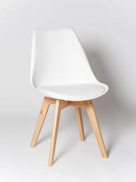
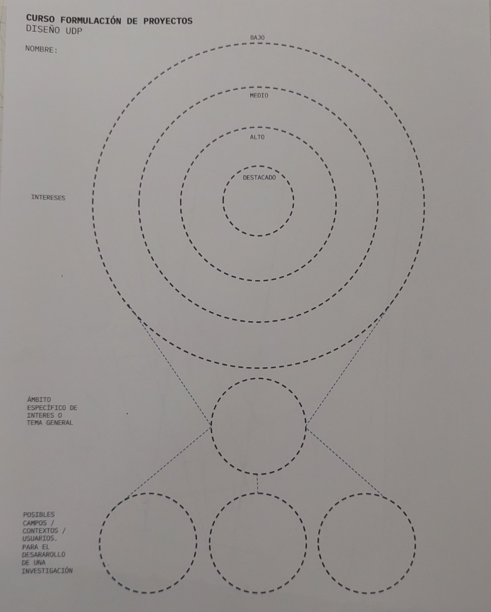
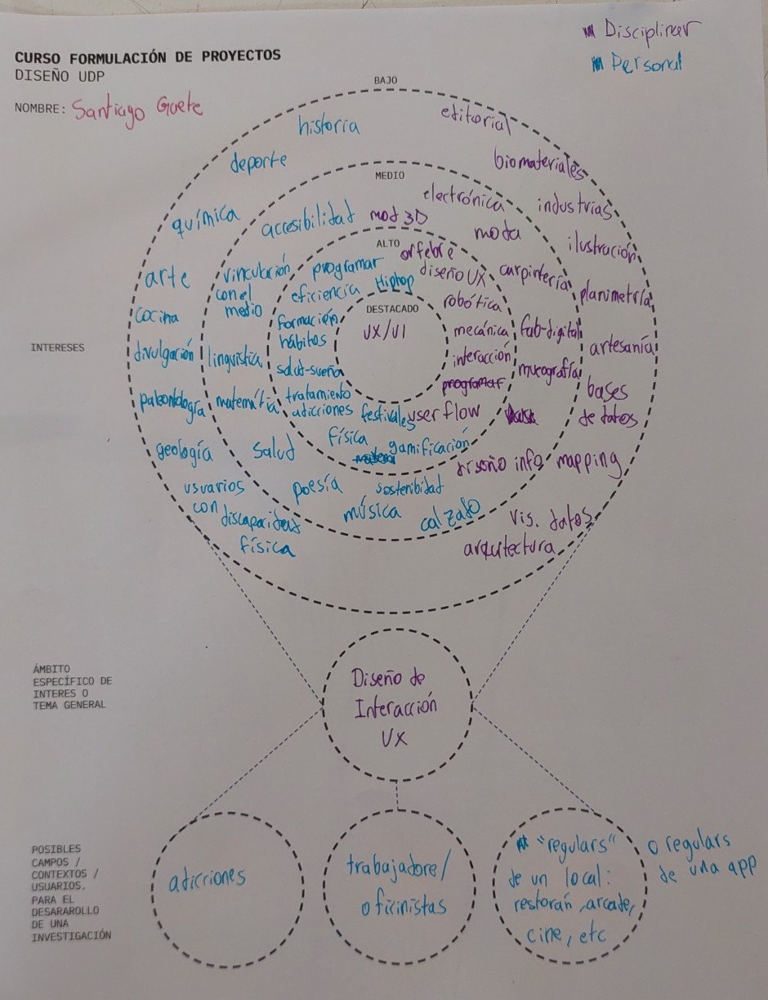
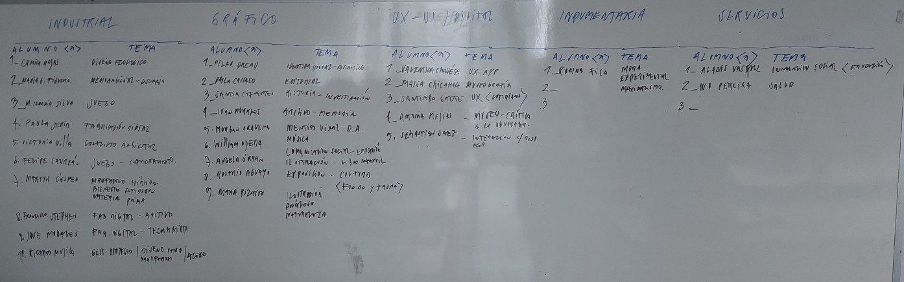
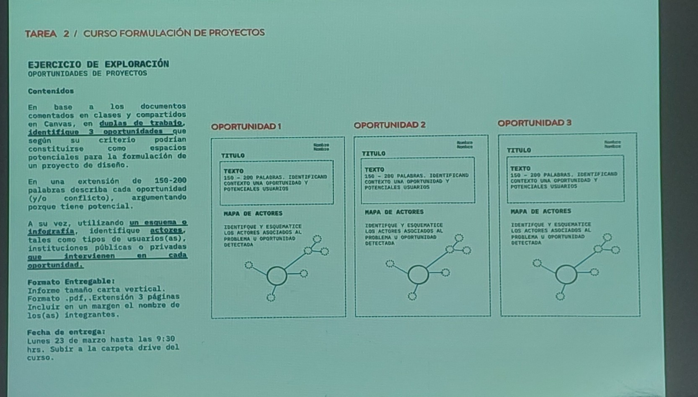

# sesion-02

2026-03-16, lunes

## repaso clase anterior

el concepto de proyecto: lo que nosotros proyectamos hacia el futuro, poder concatendamente mantener la visión de control.

Proyecto: pensamiento o porpósito de ejecutar algo.

### Características

- un objetivo o fin
- un plazo determinado
- un prsupuesto definido

#### caracteristicas complementarias

- un proyecto no es repetitivo, se realiza una sola vez
- es homogéneo, porque todas las áreas involucradas concurren al objetivo
- es complejo, por las relaciones y restricciones que se generan
- es humana, porque implica desiciones subjetivas

### fases

tenemos 5 etapas:

- inicio
- planificación
- ejecución
- monitorieo
- cierre

durante el curso no llegaremos más allá de la etapa 3.

### punto de partida

es importante que un proyecto no nace del desespero, el pryecto surge a medida que tu estudias un ámbito.

- ¿qué necesidad va a satisfacer?
- ¿por medio de qué servicio o producto?
- ¿a quiénes va dirigido?
- ¿con qué recursos cuenta?
- ¿cuál será la localización o ubicación?
- ¿cómo determina el precio?
- ¿cuándo comenzará el proyecto?
- identificación de alternativas

Esta silla es un ejemplo llamativo, valen como $20.000-25.000CLP, pero es precio directo al fabricante es cmo de $3.500CLP

## fuentes de ideas para nuevos proyectos

fuente: Fuentes de ideas para nuevos proyectos. Arthur Kuriloff y John M. Hemphill(1983).

La invención es muy  a meudo el rsultado de la percepción clara de una necesidad desde la rigurosa observación de los usuarios y sus necesidades. Muchas veces las inspiración nace de intereses personales, hobbies, capacidades, habilidades u experiencias de la personas emprendedora.

También la observación de tendencias sociales. Cambios de tendencias demográficas, estilos de vida y patrones de consumo:

- ¿Qué cambios están suceiendo en los hábitos de compra y en las acittudes del consumidor?
- ¿Cuáles son las necesidade especiales de ciertos grupos del mercado?
- ¿Hay en marcha algún plan de desarrollo que implique cambios zonales?

### usuarios

Los usuarios no están solos. Es importante tener en cuanta también lo que los rodea.

- ¿Qué productos o servicios están faltando?
- ¿Porqué aquel producto no existe?
- ¿cuáles son los cambios tecnológico que están ocurriendo en el mercado?

### otros puntos de partida

Productos existentes en otro mercados

- estudiar lo que se ofrece en otros mercados, considera comercializarlo en tu propio mercado
- agregar valor a productos existentes.
- identificar in nicho de mercado descuidado por otros. Existen sectores peuqeños los cuales las grandes empresas no pueden atender.
- buscar oportunidades de negocios en publicaciones, licitaciones, concursos, etc.

## actividad

1. pensamiento divergente:
   1. tus intereses desde la disciplina. En un color.
   2. ambitos de interés personal: hobbies, pasión, etc. En otro color.
   3. Anotar en los anillos conceptos o mensajes clave para identificar aquellos interes y ámbitos de interés.
2. pensamiento convergente:
   1. primer círculo. Anotar 1 tema de interés general.
   2. 3 ciruclos de abajo: anotar posibles contextos/usuarios específicos para el desarrollo de una investigación basada en el temá de interés y contexto.

luego de esto hicimos un ejercicios en conjunto donde en ka pizarra anotamos nombres e intereses, separado por áreas: industrial, gráfico, ux-digital, indumentaria, servicios.

Mi respuesta: Diseño UX, centrado en lo cotidiano.

con esto, debemos crear parejas, ya sea por amistá, o porque combinan en intereses.

## escasez

Para que exista un mercado, tiene que existir escasez.

La escacez puede aparecer por temas no predictibles. Ejemplo: desastres naturales, pandemia, etc.

Pero tmabién la escasez se puede inventar. Las empresas generan situaciones escasez.

Para que un mercado sea saludable deben existir situaciones de escasez.

Este concepto es **ESENCIAL**

## encargo-01

No todos los proyectos se terminan ejecutando.

Nosotres como estudiantes tenemos experiencia en diseñar, pero no en fomrular.

- entrega digital: 3 posibles iniciativas de proyecto, en 3 diapositivas distintas

Tabla traspasada a texto por chatgpt:

| Área | Alumno | Tema |
| ----- | -------- | ------ |
| Industrial | Camila Rojas | Diseño cervecero |
| Industrial | María B. Soto | Medioambiente – energía |
| Industrial | M. Ignacia Silva | Juego |
| Industrial | Paula Venia | Fabricando vidrio |
| Industrial | Victoria Villa | Control analítico |
| Industrial | Feña (?) | Juego – comportamiento |
| Industrial | Martina Césped | Materiales híbridos / bienestar cotidiano / materialidad blanda |
| Industrial | Camilo Stephem | Farm digital – agrotec |
| Industrial | José Morales | Farm digital – tecnificación |
| Industrial | Ricardo Muñoz | Gestión hídrica / juego como instrumento / agua |

| Área | Alumno | Tema |
| ----- | -------- | ------ |
| Gráfico | Pilar Oream | Identidad visual – gráfica |
| Gráfico | Laila Calipso | Editorial |
| Gráfico | Simona Ciprietes | Historia – investigación |
| Gráfico | Livia Maffei | Archivo – memoria |
| Gráfico | Montse Herrera | Memoria visual – D.A. |
| Gráfico | William Otega | Música |
| Gráfico | Angelo Oryan | Comunicación social – estrategia |
| Gráfico | Primi Abry | Ilustración – libro infantil |
| Gráfico | Mara Pizarro | Expresión – cultura (forma y trama) |

| Área | Alumno | Tema |
| ----- | -------- | ------ |
| UX – UI / Digital | Valentina Chávez | UX – app |
| UX – UI / Digital | María Chicama | Videocreativo |
| UX – UI / Digital | Santiago Soto | UX – creatividad |
| UX – UI / Digital | Amanda Mejía | Micro-cápsula / lo diverso |
| UX – UI / Digital | Sebastián Sáez | Interacción / diseño |

| Área | Alumno | Tema |
| ----- | -------- | ------ |
| Indumentaria | Ronny Fica | Moda experimental / maximalismo |
| Indumentaria | — | — |
| Indumentaria | — | — |

| Área | Alumno | Tema |
| ----- | -------- | ------ |
| Servicios | Alanis Vásquez | Innovación social (entorno) |
| Servicios | Ivi Pentina | Salud |
| Servicios | — | — |

ambitos a tener en cuenta:

- proyecto que son de mucho interés para une
- proyectos que suplan una necesidad no atendida

Hacer eso es la primera parte del encargo, la otra mitad se hace en clase.

- traer post-it la próxima semana!

### conceptos relevantes

- consumidor y prosumidor.
- [prosumidor](https://es.wikipedia.org/wiki/Prosumidor): personas dispuestas a pagar por la diferenciación.
