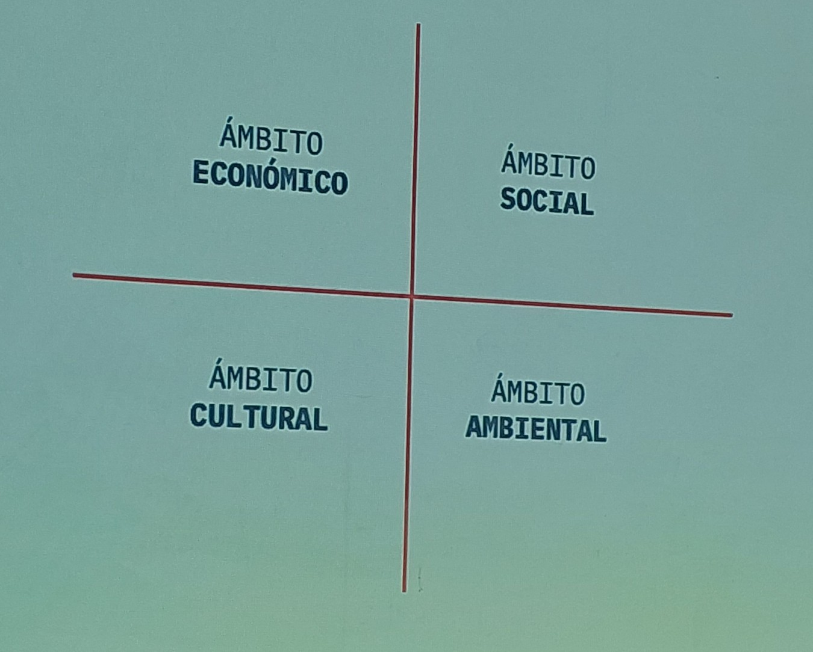
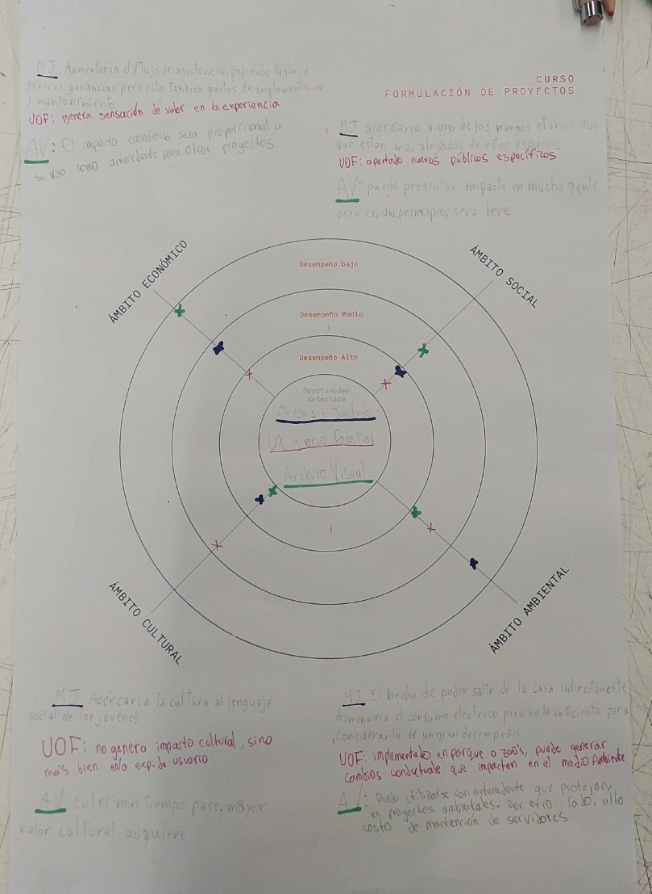
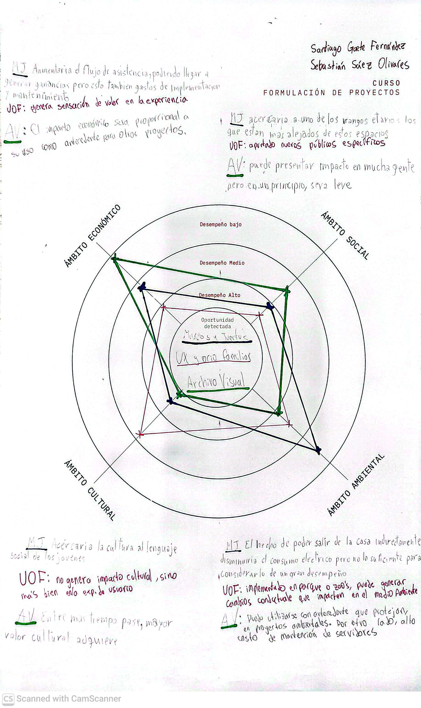

# sesion-03

2026-03-23

hoydía revisamos el [encargo-01](../encargos/encargo-01/files/dis8925-encargo-01.pdf)

**La formulación de proyectos tiene el propósito de identificar cuidadosamente el objetivo.**

La observación de una ausencia. ¿Qué está faltando?¿cuáles son los cambios tecnológicos que están ocurriendo en el mercado?

## evaluación de proyectos

¿por qué evaluar proyectos?

### escasez

la necesidad de evaluar proyectos surge del concepto de escasez.

- **escasez:** Un bien es escaso cuando la demanda que existe por él es mayor que la cantidad existente del bien.

No se pueden poner los recursos en todos los proyectos, hay que elegir.

En cada institución hay alguien que evalúa proyectos.

Decidir que financiar es parte de la formulación de proyectos.

La teoría económica supone que tanto consumidores como empresas buscan maximizar su nivel de bienestar. Esto significa que siempre buscarán el mayor bienestar con la menos inversión posible.

### concepto de riesgo

existe el riegos cuando los eventos que sucederán no son determinísticos. cuando existe la incerteza.

causa de riesgo:

    - desarrollo tecnológico
    - cambios legislativos
    - cambios en las preferencias de los consumidores
    - la competencia
    - poco conocimiento del mercado:
        - precios
        - demanda
        - plazos de adopción(penetración)
        - costos de insumos

### beneficios

elemento clave para la toma de decisiones. Son diversos:

    - ingresos monetarios
    - ahorro de costos
    - aumentos de excedente del consumidor
    - revalorización de bienes
    - reducción de riesgos
    - impacto ambiental positivo
    - mejor imagen
    - mejor seguridad

las personas quieren saber porqué las cosas son importantes para ellos.

### puntos de partida

calificar cada cuadrante según incidencia en la categoría. Con distintos colores cada iniciativa, posicionándolas según su incidencia en cada ámbito.

- ámbito económico: plata
- ámbito social: personas beneficiarias, impactos que quiero generar. Enfocado en un usuario específico.
- ámbito cultural: grado de pertinencia. También asociado al **impacto**. educación, ámbito intelectual, de difusión, **transformación**
- grado ambiental: reutilización de materiales

por lo general, en proyecto de título, los primeros 2 ámbitos son "obligatorios", los últimos 2 no son obligatorios.

## preview prox-sesion

procesos básicos para determinar los costos y beneficios de un proyecto

- identificación: ¿cuáles?
- cuantificación: ¿cuántos?
- valoración: ¿Cuánto vale?

- costos reales vs costos contables
- costos evitables vs costos sumergidos
- costos fijos vs costos variables

categorías de costos:

- inversión
- operación
- mantenimiento

### actividad en clase

Luego conversar sobre "la idea más valiosa". Queremos evaluar conceptualmente los proyectos, para determinar el tamaño del mercado. Los productos de diseño no staisfacen todas las necesidades, satisfacen necesidades específicas.

Nuestro proyecto: Archivo Visual:

- un proyecto que busca documentar y registrar el paso del tiempo en distintos lugares, paisajes y edificios. El proyecto se vende como poseedor de cierto sello de credibilidad. Usuaries: colegios, universidades, artistas y productores audiovisuales.

## links relevantes

- [Vitra](https://www.vitra.com/es-un/product)
- [0300TV](https://www.onarchitecture.com/offices/0300tv)