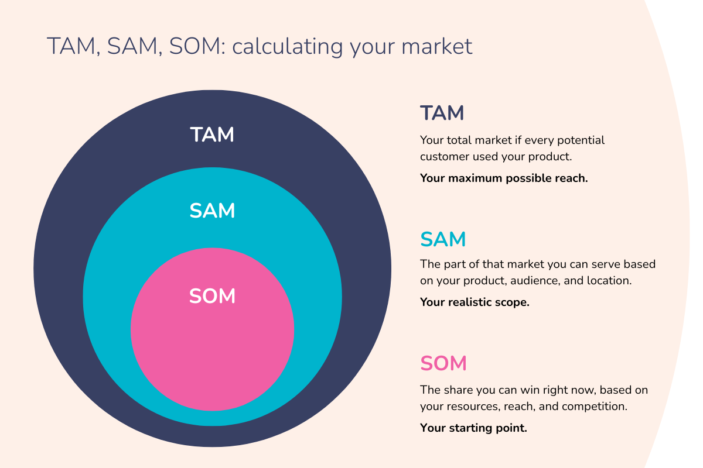

# sesion-04

2026-03-30

anotación: revisar pp5 pa notar costos fijos, sumergidos, variables, evitables, etc.

## investigación de mercado

hoy comenzamos el desarrollo de lo que será la primera solemene-01

se entrega el día martes(1 día después de la sesion-05)

### sesgo de superviviencia

[el sesgo de supervivnecia](https://es.wikipedia.org/wiki/Sesgo_del_superviviente), responde a la idea que, usualmente se tiende a pensar que habría que reforzar las partes donde llegan más balas, pero dado el contexto(los aviones que estudiaban era con lo que sobrevivían) se dieron cuenta que en realidad deberían reforzar las partes donde no les llegan balas, que permitiría que sobrevivan aún más.

La idea clave de este sesgo, es desconfiar en las información que tengo a la vista, ir más allá. Toda la información disponible no es suficiente para poder tomar una decisión. Lo importante que deberían observar son los aviones que no llegaban, no los que sí llegaban.

Las verdades absolutas suelen generar sesgos. Salirse del tunnel vision.

## tare-04

un informe:

- se describe el resultado de character cualitativa respecto a a la tarea de la semana pasada. Argumentando porqué seleccionaron aquel proyecto.

- información cuantitativa

Justificar desde ambos ámbitos cuál de tu 3 iniciativas sería más atractivo de ser financiado.

tener en cuenta:

- ¿cuáles son los beneficios de financiar este proyecto?
- ¿cuantificación?
- ¿costos?

## cátedra

necesitamos mercados sanos, son aquellos que permanentemente tienen renovación. Hay mercados más cíclicos o menos cíclicos. La gente no deja de comer sin importar el estado de la social y económico del mundo.

Los consumidores y las empresas suelen buscar maximizar su nivel de bienestar. Las familias mueven la economía del país.

Todo proyecto tiene cierta tasa de riesgo. **Todos los proyectos de innovación son altamente riesgosos.**

- Hay fondos que piden cierta garantía, a veces en proyectos te piden una boleta de garantía del 10% del precio total.

Hay múltiples ámbitos en los que se puede innovar. Precio, contexto temporal "go to market", etc.

### incertidumbre

cuando las probabilidades de ocurrencia de un evento no están cuantificadas. Informaci´pon incompleta, inexacta, sesgada, falsa o contradictoria.

causas de riesgo e incertidumbre:

- el desarrollo tecnológico
- cambios legislativos
- cambios en las preferencias de los consumidores
- la competencia
- conocimiento de mercado
- precios
- demanda
- plazos de adopción(penetración)
- costos de insumos

## post-break

ahora la tarea 4 es la solemne-01

- se entrega el martes 6 de abril. Plazo máximo 23:59

### solemne-01

informe formato carta vertical.

1. descripción de propuestas potenciales de proyecto.(tarea-02)
2. evaluación cualitativa.(tarea-03). Determine la iniciativa con mayor viabilidad. Conclusiones de porqué. Definir cada proyecto en una palabra clave. Mencionar cuál es el mejor en cada atributo.
3. estudio demanda: determinar el tamaño de mercado para cada na de las iniciativas. Concluye cuál iniciativa tiene mayor área de mercado.
4. conclusiones poner en balance cuali y cuanti. Matriz de atributos.
5. fuentes: integrar fuentes y bibliografía

- referencia básica: [CENSO 2024](https://censo2024.ine.gob.cl/resultados-dashboard/)

## continuación clase

### categorías de costos

1. inversión: prospectación de clientes, capacitación, máquinas y equipos, etc.
2. operación: sueldos, arriendos, patentes, publicidades, seguros, etc.
3. mantenimiento: repuestos, reposición, reparaciones, etc.

Debemos hacer un análisis de mercado:

- análisis de la oferta
- análisis de la demanda
- análisis de los precios
- análisis de la comercialización

### mercados viejos vs nuevos

viejos:

- estable
- monopolios
- mercado protegidos
- poca tecnología
- producto como lo más importante

nuevos:

- dinámico
- alta competencia
- mercado libre y global
- alta tecnología
- cliente como foco

destrucción creativa. Las empresa quieren crear modelos que destruyan a la competencia

- chile tiene una economía extremadamente abierta, a diferencia de argentina o brasil, que ponen muchos impuestos/aranceles a productos extranjeros, para potenciar el mercado nacional,.

- TAM: "tamaño del universo"
- SAM: a cuántos cliente llegaré
- SOM: quiénes serán los compradores más probables

## relevante

- [crisis subprime](https://en.wikipedia.org/wiki/Subprime_mortgage_crisis)
- [expo min](https://www.expomin.cl)
- [tupperware](https://www.tupperware.cl/index)
- <https://cadem.cl>
- <https://cadem.cl>
- <https://www.bcg.com>
- [Hardvard Bussiness Review](https://hbr.org/subscriptions)
