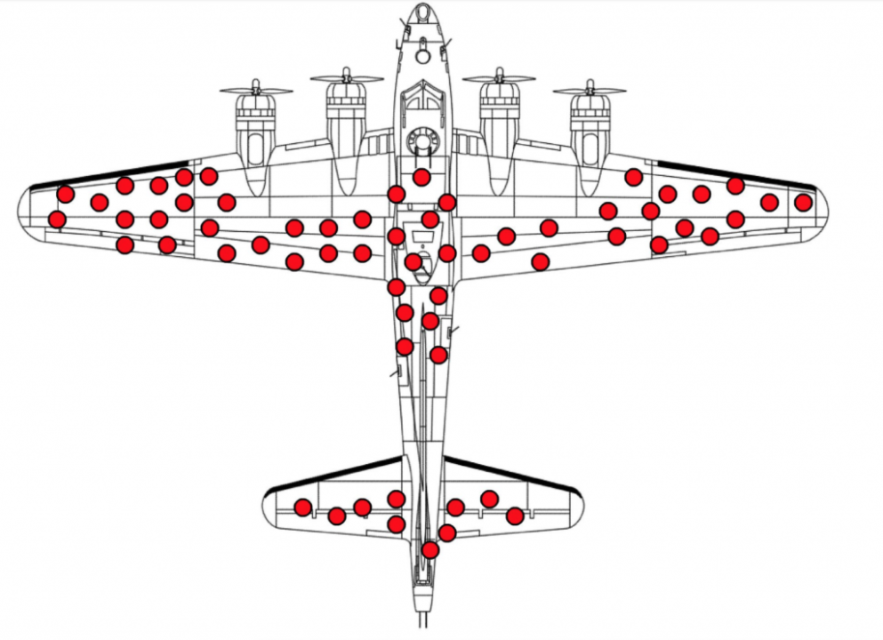

# sesion-04

2026-03-30

## investigación de mercado

hoy comenzamos el desarrollo de lo que será la primera solemene-01

se entrega el día martes(1 día después de la sesion-05)

### sesgo de superviviencia

[el sesgo de supervivnecia](https://es.wikipedia.org/wiki/Sesgo_del_superviviente), responde a la idea que, usualmente se tiende a pensar que habría que reforzar las partes donde llegan más balas, pero dado el contexto(los aviones que estudiaban era con lo que sobrevivían) se dieron cuenta que en realidad deberían reforzar las partes donde no les llegan balas, que permitiría que sobrevivan aún más.

La idea clave de este sesgo, es desconfiar en las información que tengo a la vista, ir más allá. Toda la información disponible no es suficiente para poder tomar una decisión. Lo importante que deberían observar son los aviones que no llegaban, no los que sí llegaban.

Las verdades absolutas suelen generar sesgos. Salirse del tunnel vision.

## tare-04

un informe:

- se describe el resultado de character cualitativa respecto a a la tarea de la semana pasada. Argumentando porqué seleccionaron aquel proyecto.

- información cuantitativa

Justificar desde ambos ámbitos cuál de tu 3 iniciativas sería más atractivo de ser financiado.

## cátedra

necesitamos mercados sanos, son aquellos que permanentemente tienen renovación. Hay mercados más cíclicos o menos cíclicos. La gente no deja de comer sin importar el estado de la social y económico del mundo.

Los consumidores y las empresas suelen buscar maximizar su nivel de bienestar. Las familias mueven la economía del país.

Todo proyecto tiene cierta tasa de riesgo. **Todos los proyectos de innovación son altamente riesgosos.**

- Hay fondos que piden cierta garantía, a veces en proyectos te piden una boleta de garantía del 10% del precio total.

Hay múltiples ámbitos en los que se puede innovar. Precio, contexto temporal "go to market", etc.

### incertidumbre

cuando las probailidades de ocurrencia de un evento no están cuantificadas. Informaci´pon incompleta, inexacta, sesgada, falsa o contradictoria.

causas de riesgo e incertidumbre:

- el desarrollo tecnológico
- cambios legislativos
- cambios en las preferencias de los consumidores
- la competencia
- conocimiento de mercado
- precios
- demanda
- plazos de adopción(penetración)
. costos de insumos

## relavante

- [crisis subprime](https://en.wikipedia.org/wiki/Subprime_mortgage_crisis)
