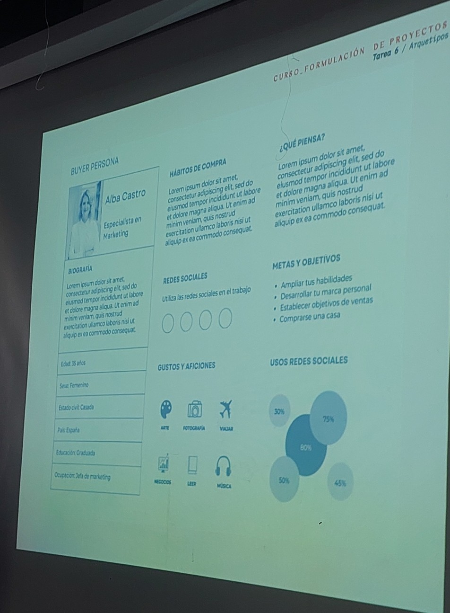
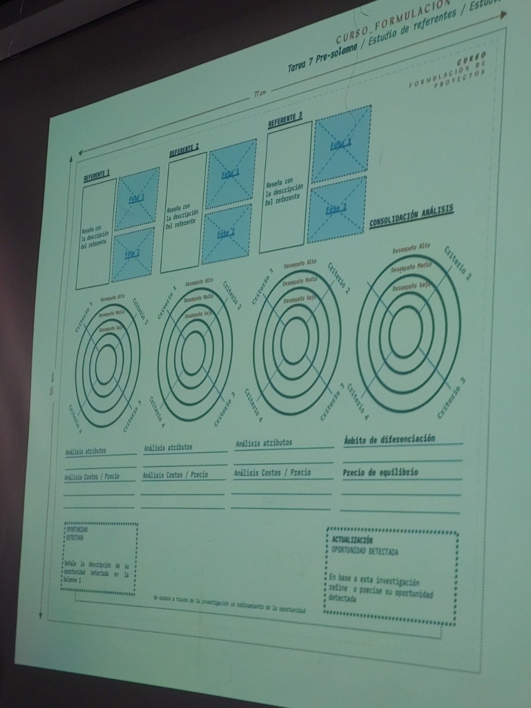

# sesion-08

2026-04-27

precio de equilibrio.

cuántas unidades debo generar al mes para poder acercarme al valor que construimos la semana pasada?

¿cómo perfilar un producto?

debemos ocnstruir una oferta de valor diferenciadora.

## tarea-07

